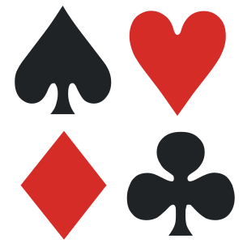

# Identificador de Naipes
#### Hecho por:
- Royer Donnet Arenas Camacho - A01209400
- Sebastian Resendiz Chavez - A01701111
- Jesús Olmos Larios - A01275595

## Introducción
La baraja francesa ha acompañado a la humanidad desde hace varios siglos, siendo una de las formas de entretenimiento más longevas que existen. Cuenta con 52 naipes, repartidos en cuatro palos: Corazones, Diamantes, Tréboles y Picas.

Si bien el ser humano ha creado más de 100 formas únicas de jugar con los naipes de la baraja francesa, ¿Qué sucede cuando una persona no cuenta con la capacidad de ver o distinguir correctamente sus naipes? No solo no podría jugar apropiadamente, si no que se perdería de la diversión que provocan los juegos de este tipo.

A través del uso de ciertas librerías y las maravillas de las redes neuronales, nuestro proyecto es capaz de leer e identificar correctamente las cartas que se le muestren a través de la cámara de nuestra computadora.

## Herramientas utilizadas
- cv2
OpenCV es una biblioteca libre de visión artificial originalmente desarrollada por Intel. OpenCV significa Open Computer Vision (Visión Artificial Abierta). Desde que apareció su primera versión alfa en el mes de enero de 1999, se ha utilizado en una gran cantidad de aplicaciones, y hasta 2020 se la sigue mencionando como la biblioteca más popular de visión artificial.

- tensorflow
TensorFlow es una biblioteca de código abierto para aprendizaje automático a través de un rango de tareas, y desarrollado por Google para satisfacer sus necesidades de sistemas capaces de construir y entrenar redes neuronales para detectar y descifrar patrones y correlaciones, análogos al aprendizaje y razonamiento usados por los humanos.

- keras
Keras es una biblioteca de Redes Neuronales de Código Abierto escrita en Python.
Está especialmente diseñada para posibilitar la experimentación en más o menos poco tiempo con redes de Aprendizaje Profundo. Sus fuertes se centran en ser amigable para el usuario, modular y extensible.

- numpy
NumPy es una biblioteca para el lenguaje de programación Python que da soporte para crear vectores y matrices grandes multidimensionales, junto con una gran colección de funciones matemáticas de alto nivel para operar con ellas.

- layers
Son los bloques de construcción básicos de redes neuronales en Keras. Una "layer" consiste en funciones computacionales de "tensor-in tensor-out" y algún estado, dentro de variables TenserFlow.

- os
Este módulo provee una manera versátil de usar funcionalidades dependientes del sistema operativo.

## ¿Cómo utilizar el proyecto?

## Referencias
- GitHub. (29 de Agosto de 2022). Obtenido de https://github.com/opencv/opencv-python
- Google. (9 de Noviembre de 2015). YouTube. Obtenido de https://www.youtube.com/watch?v=oZikw5k_2FM
- Keras.io. (20 de Noviembre de 2022). Obtenido de https://keras.io/api/utils/backend_utils/
- Keras.io. (20 de Noviembre de 2022). Obtenido de https://keras.io/api/layers/
- python.org. (20 de Noviembre de 2022). Obtenido de https://docs.python.org/es/3.10/library/os.html
- Svitla. (12 de Noviembre de 2019). Obtenido de https://svitla.com/blog/overview-of-modern-computer-vision-tools
